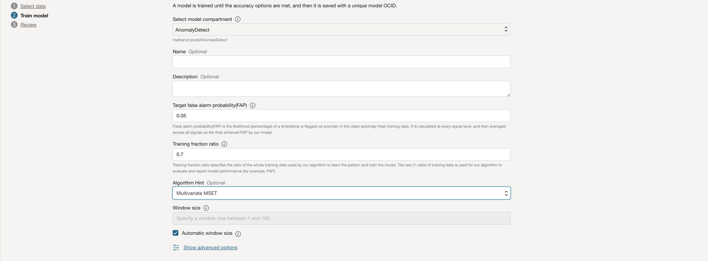

# Anomaly Detection Project

This project uses Oracle Cloud Infrastructure (OCI) to deliver anomaly detection capabilities. Developed using a multivariate time-series algorithms from Oracle Labs, it offers tailored machine learning models for real-time and batch anomaly detection.


The Oracle Cloud Infrastructure (OCI) Anomaly Detection service offers customized machine learning models by leveraging user-uploaded data. The service utilizes the core algorithm to train models, which are then hosted in the cloud and ready for anomaly detection. Users can interact with the service via public REST APIs, OCI CLI, or the Cloud Console.


## Acknowledgements

- [Oracle Cloud](https://docs.oracle.com/en/cloud/get-started/index.html)
- [Oracle Labs](https://labs.oracle.com/)
- [Oracle Developer](https://developer.oracle.com/)
- [Oracle Documentation](https://docs.oracle.com/)

## Badges

[](https://cloud.oracle.com/)
[](https://cloud.oracle.com/anomaly-detection)
[](https://cloud.oracle.com/machine-learning)
[](https://docs.oracle.com/en-us/iaas/api/)
[](https://cloud.oracle.com/data-analytics)
[](https://cloud.oracle.com/devops)
[](https://cloud.oracle.com/networking)
[](https://choosealicense.com/licenses/mit/)
[](https://github.com/your-username/your-repo)


## Anomaly Detection
Anomaly Detection is the process of identifying rare items, events, or observations in data that deviate significantly from the norm. It's commonly used across various industries like utility, aviation, transportation, and manufacturing for tasks such as asset monitoring and prognostic surveillance.

## Key Terms
- **False Alarm Probability (FAP)**: A measure indicating the likelihood of a timestamp being flagged as an anomaly in the absence of actual anomalies. Lower FAP values imply higher precision but may require longer training times.
- **Training Data**: Time-series data used to train the anomaly detection model. It should be anomaly-free and cover all normal scenarios with full value ranges for all attributes.
- **Data Asset**: A reference to the training data stored in Oracle Object Storage, used by the anomaly detection system during model training and inference.
- **Sensitivity Tuning**: Adjusting the sensitivity parameter of the algorithm to control the number of anomalies detected. Higher sensitivity values result in more anomalies being flagged.


## Model Parameters
### FAP (False Alarm Probability)
FAP stands for False Alarm Probability, indicating the likelihood of a timestamp being falsely flagged as an anomaly in the clean training data. Lower FAP values imply higher precision but may require longer training times.

#### How to Calculate FAP:


Typically, FAP can be set around the same percentage as anomalies in real business scenarios. A value of 0.01 or 1% is often appropriate. Lower target FAP values increase training time.

### Train Fraction Ratio
Train Fraction Ratio specifies the ratio of the training data used for model learning. The default value of 0.7 implies 70% of the data is used for training, and 30% for model evaluation and performance reporting.


### Training Data
Time-series data used to train the anomaly detection model. It should be anomaly-free and cover all normal scenarios with full value ranges for all attributes.
### Data Asset
A reference to the training data stored in Oracle Object Storage, used by the anomaly detection system during model training and inference.
### Sensitivity Tuning
Adjusting the sensitivity parameter of the algorithm to control the number of anomalies detected. Higher sensitivity values result in more anomalies being flagged.

## Screenshots

### Compartment Creation

Creating a new compartment in the OCI console.

### Bucket Creation

Creating a new bucket in Oracle Cloud Object Storage.

### Model Creation

Configurating settings for anomaly detection model in OCI. (FAP/Train Fraction Ratio)


### Results Visualization

visualizing the anomaly detection results through this interface.
- Orange line indicates the actual input value of a signal, purple line indicates the predicted value by the machine learning model, and red line indicates anomaly being detected at that timestamp.
- The anomaly score per signal shows the significance of anomaly at individual signal level for a given timestamp. Not all the signals flag anomalies at the same time.
- The aggregated anomaly score indicates the significance of anomaly for a given timestamp by considering the anomaly from all signals together.

### Result Storage Bucket

Store the results of anomaly detection in the dedicated storage bucket.

### Sample Result Output

```json
[
  {
    "timestamp": "2019-01-07T21:27:02.000+00:00",
    "anomalies": [
      {
        "signalName": "temperature_3",
        "actualValue": -2.253762405930675,
        "estimatedValue": -1.3263819086367163,
        "anomalyScore": 0.5457369453612876
      }
    ],
    "score": 0.1171886917076391
  }
]

